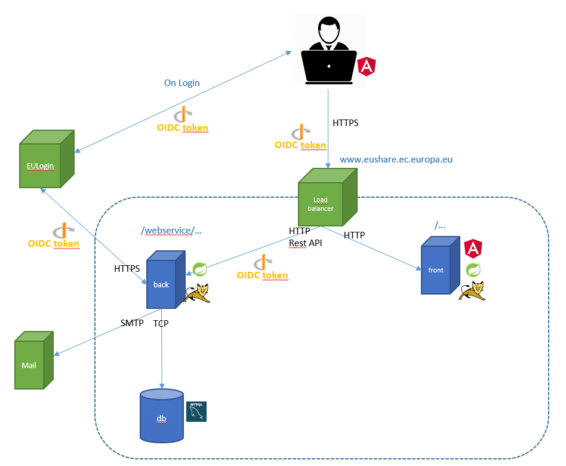

# EUShare
EUShare is a file exchange tool from the European Commission. Its source code is published as open source software under the terms of the EUPL public license.
The project distributes a servlet-based spring boot application server and an angular front end application.

* Latest CircleCI build [](https://circleci.com/gh/CIRCABC/EasyShare/tree/develop)

## Installation requirements
1. Java 8
1. MySQL 5.7
1. Maven
1. Maildev (https://www.npmjs.com/package/maildev)

## Architecture overview
The application consists in three main artifacts the developper must maintain:
1. A front-end application written in Angular, served by in a Spring boot application and hosted on a Tomcat server.
1. A back-end application written in Java/Spring-Boot, hosted on a Tomcat server. The front-end communicates with the back-end using a Rest API.
1. A Mysql database. The back-end communicates with the database using the Mysql driver.

The application also communicates with two external servers, which should be maintained by the operation teams:
1. EULogin, a Single Sign-On Solution (SSO) maintained by DIGIT. This is the server a user is redirected to at login time. EULogin communicates with the front-end and the back-end using Open Id Connect Protocol (OIDC).
1. A mail server. This is the server used to send EUSHARE's emails. Only the back-end interacts with this server using the SMTP protocol.

Finally, one more server is used for distributing EUSHARE. That is a load balancer a user is redirected to when accessing the application's URL. In order to differenciate the HTTP queries from the user to the back-end or to the front-end, all queries to the back-end start by __/webservice__.



## Quick start
The project contains three main folders. 
- __client__: contains the application 'front-end'. That is, a Spring Boot application containing an Angular application. 
- __server__: contains the application 'back-end'. That is, a Spring Boot application.
- __docker__: contains a docker file for each of the architectural components of the application and a docker-compose file to run a complete environment locally. You may find useful resources here for creating a new acceptance/test/production environment.

To start developping:
1. Run Ecas/EuLogin_ locally from __/user_projects/domains/base_domain__ folder (https://localhost:7002/cas) 
    ``` batch
    startWebLogic.cmd
    ```
    
1. Setup Open Id Connect locally in EULogin:
    - Go to https://localhost:7002/cas/admin/tools/
    - Authenticate as the basic user created by ECAS __jason.bourne@ec.europa.eu__ the development password is __Password123__. The development token (if needed) is __0123456789__.
    
    - Register the back-end Open Id connect configuration at https://localhost:7002/cas/admin/tools/openidconnect/load. Prefer using the application for it, do not copy paste the JSON. The values to enter are the following, for each field:
        ``` json
        {
        "application_type" : "web",
        "client_name" : "EUSHARE_SERVER",
        "contacts" : [ "your.email@ext.ec.europa.eu" ],
        "default_acr_values" : [ "https://ecas.ec.europa.eu/loa/basic" ],
        "default_id_token_max_age" : 46800,
        "grant_types" : [ "authorization_code", "urn:ietf:params:oauth:grant-type:token-exchange" ],
        "id_token_signed_response_alg" : "PS512",
        "redirect_uris" : [ "http://localhost:8888/callback" ],
        "response_types" : [ "code" ],
        "scope" : "openid email profile phone hr authentication_factors",
        "subject_type" : "public",
        "tls_client_certificate_bound_access_tokens" : false,
        "token_endpoint_auth_method" : "client_secret_basic"
        }
        ```
    - EuLogin should now display the secret between EULogin and the backend which needs to be copy/pasted into __server/src/main/resources/application.yaml__ for the value of __spring-security-oauth2-resourceserver-opaquetokenclient-secret__.

    - Now register the front-end Open Id connect configuration at https://localhost:7002/cas/admin/tools/openidconnect/load. Prefer using the application for it, do not copy paste the JSON. The values to enter are the following, for each field:
        ``` json
        {
        "application_type" : "native",
        "client_name" : "EUSHARE_CLIENT",
        "contacts" : [ "your.email@ext.ec.europa.eu" ],
        "default_acr_values" : [ "https://ecas.ec.europa.eu/loa/basic" ],
        "default_id_token_max_age" : 46800,
        "grant_types" : [ "implicit", "urn:ietf:params:oauth:grant-type:jwt-bearer" ],
        "id_token_signed_response_alg" : "PS512",
        "redirect_uris" : [ "http://localhost:8080/callback" ],
        "response_types" : [ "id_token" ],
        "scope" : "openid email profile phone hr authentication_factors",
        "subject_type" : "public",
        "tls_client_certificate_bound_access_tokens" : false,
        "token_endpoint_auth_method" : "none"
        }
    - Go to https://localhost:7002/cas/admin/tools/showOpenIdConnectConfiguration.cgi this displays a similar JSON with additional values.
    - From the EUSHARE_CLIENT configuration, copy the __"client_id"__ token value and paste it into __client/angular/src/environments/environment.ts__  for the value of __OIDC_CLIENTID__.
    - From the EUSHARE_SERVER configuration, copy the __"client_id"__ token value and paste it into __server/src/main/resources/application.yaml__ for the value of __spring-security-oauth2-resourceserver-opaquetoken-client-id__
1. Run _Maildev_ locally (http://localhost:1080/#/)
    ``` batch
    maildev
    ```
1. Run and setup _Mysql_ locally (mysql://localhost:3306)
    ``` sql 
    CREATE DATABASE easyshare DEFAULT CHARACTER SET utf8;
    CREATE USER 'easyshare'@'%' IDENTIFIED BY 'easyshare';
    GRANT ALL PRIVILEGES ON easyshare.* TO 'easyshare'@'%';
    ```

1. Run the front-end application from __/client/angular__ folder (http://localhost:8080/)
    ``` batch
    npm start
    ```
1. Build the back-end application from __/server__ folder
     ``` batch
    mvn clean package
    ```
1. Run the back-end application from __/server__ folder (http://localhost:8888)
     ``` batch
    java -jar target/easyshareserver.war
    ```

You can now start using the application from http://localhost:8080/. Login using the existing user Jason Bourne. If you want to add more users, please refer to the Eulogin configuration files __user_projects/domains/base_domain/classes/userDataBase.xml__