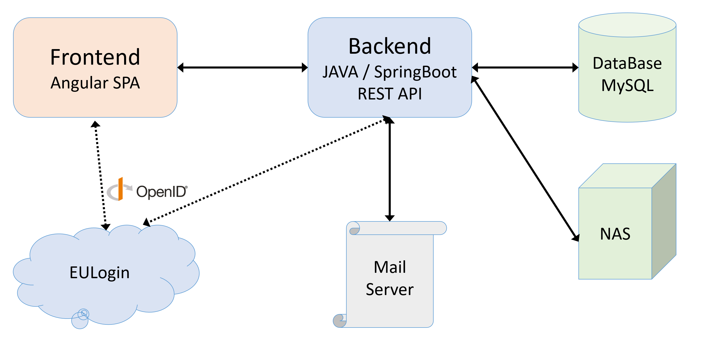

# EUShare

**EUShare** is a secure file exchange platform developed by the European Commission. It enables the **sharing of large files** (up to 5 GB) between users, with features such as file expiration, download notifications, password-protected access, and recipient management.
Authentication is managed via **EU Login** (SSO), ensuring a seamless and secure experience.

Source code is published under the terms of the [EUPL public license](https://joinup.ec.europa.eu/collection/eupl/eupl-text-eupl-12).

---

## Key Features

* **Simple, Secure File Sharing:** Upload, share, and track files up to 5GB.
* **Fine-grained Sharing:** Add recipients, send notification emails, set optional file passwords.
* **Automatic Expiration:** Files are shared with an expiration date and are automatically deleted after expiry.
* **Notifications:** Get notifications when files are downloaded.

---


## Architecture Overview

* **Frontend:** Angular SPA, communicates with backend via REST API.
* **Backend:** Java/Spring Boot REST API, manages storage, business logic, and notifications.
* **Database:** MySQL (stores file metadata, users, shares, audit logs).
* **Mail Server:** Used for notifications (Maildev for development).
* **EULogin:** Official EU Login for production, or a mockup server for development.
* **API Contract:** The REST API is fully described in `api.yaml` at the project root, following the [OpenAPI](https://www.openapis.org/) standard. This file is used to **generate both backend and frontend code stubs**, ensuring the contract stays consistent between client and server.
* **Dockerized Deployment:** All components can be run with Docker.


---


# 1. Deployment

This section explains how to **deploy EUShare** using the official EULogin service and Tomcat (with or without Docker).

## Prerequisites

* [Docker](https://www.docker.com/) or your preferred deployment method (WAR files can also be deployed to your Tomcat servers)
* Official EULogin application registration

## 1.1 EULogin Registration

Before deployment, **ask the DIGIT EULogin team to register your applications** (you cannot do this yourself).

**Send the following information to the EULogin team:**

* **Backend Application (type: `web`):**

  * **Type:** `web`
  * **Client Name:** (e.g. `EUSHARE_SERVER`)
  * **Redirect URI:** (e.g. `https://your-domain/share/webservice/callback`)
  * **Grant Types:** `authorization_code`, `urn:ietf:params:oauth:grant-type:token-exchange`
  * **Response Types:** `code`
  * **Scope:** `openid email profile phone hr authentication_factors`
  * **Token Endpoint Auth Method:** `client_secret_basic`

* **Frontend Application (type: `native`):**

  * **Type:** `native`
  * **Client Name:** (e.g. `EUSHARE_CLIENT`)
  * **Redirect URI:** (e.g. `https://your-domain/share/callback`)
  * **Grant Types:** `implicit`, `urn:ietf:params:oauth:grant-type:jwt-bearer`
  * **Response Types:** `id_token`
  * **Scope:** `openid email profile phone hr authentication_factors`
  * **Token Endpoint Auth Method:** `none`

**You will receive:**

* Backend: `client_id`, `client_secret`
* Frontend: `client_id`
* EULogin issuer, token endpoint, etc.


## 1.2 Configuration

### **Frontend (Angular)**

Edit `client/angular/src/environments/environment.prod.ts` (for deployment) or `client/angular/src/environments/environment.dev.ts` (for development):

#### **Authentication Settings**

* `OIDC_CLIENTID` — Frontend client ID (from EULogin)
* `OIDC_BACKEND_CLIENTID` — Backend client ID (from EULogin)
* `OIDC_TOKENENDPOINT` — EULogin token endpoint

#### **Additional Important Frontend Properties**

* **Backend API URL**

  * `backend_url` — Path or URL of the backend REST API (e.g., `/share/webservice`)
  * `API_BASE_PATH` — Should match your backend API base path (e.g., `/share/webservice`)
* **Frontend Base URL**

  * `frontend_url` — Base path of the frontend application (e.g., `/share`)
* **External Integrations**

  * `circabc_url` — URL of any external service to integrate (optional, e.g., CIRCABC)
* **Maintenance**

  * `maintenance_code` — Set a code to trigger maintenance mode (optional, for admin use)

> Be sure to check and update these values before building and deploying the frontend.

---

### **Backend (Spring Boot)**

Edit `server/src/main/resources/application-prod.yaml` (for deployment) or `application-dev.yaml` (for development):

#### **Authentication Settings**

* `spring.security.oauth2.resourceserver.opaquetoken.client-id` — Backend client ID (from EULogin)
* `spring.security.oauth2.resourceserver.opaquetoken.client_secret` — Backend client secret (from EULogin)
* `spring.security.oauth2.resourceserver.opaquetoken.introspection-uri` — EULogin token introspection endpoint

#### **Additional Important Backend Properties**

* **Database Connection**

  * `spring.datasource.url` — MySQL JDBC URL
  * `spring.datasource.username`
  * `spring.datasource.password`
* **File Storage**

  * `eushare.disks` — List of directories for storing uploaded files
* **Public URL**

  * `eushare.clientHttpAddress` — External/public base URL of your EUShare instance
* **Mail Server**

  * `spring.mail.host`
  * `spring.mail.port`
  * `spring.mail.username`
  * `spring.mail.password`
* **Admin Users**

  * `spring.security.adminusers` — Comma-separated list of admin usernames
* **Other Limits and Security Options** (optional, for advanced tuning)

  * `eushare.file_recipients.*` — Recipient limits
  * `eushare.file_upload_rate.*`, `eushare.file_download_rate.*` — Upload/download limits
  * `eushare.brute_force_attack_rate.*` — Protection thresholds
  * `logging.level.root`, etc. — Log level
  * `javamelody.*` — Monitoring (optional)

> Be sure to check and update these values before deploying the backend.

---

## 1.3 Build and Deploy to Tomcat

**Main steps for deployment:**

```bash
# 1. Build the frontend (Angular) and package as WAR
cd client/angular
npm install
ng build --configuration=prod
cd ..
mvn clean install

# 2. Copy the generated WAR to the Docker Tomcat dist folder
cp target/eushareclient.war ../docker/client-tomcat/dist/eushareclient.war

# 3. Build the backend and package as WAR
cd ../server
mvn clean install -Pprod-tomcat -Dspring.profiles.active=prod

# 4. Copy the backend WAR to the Docker Tomcat dist folder
cp target/eushareserver.war ../docker/server-tomcat/dist/eushareserver.war

# 5. Start all containers with Docker Compose (Tomcat variant)
docker-compose -f docker-compose-tomcat.yaml up --force-recreate --build
```

* This builds and starts all Tomcat-based containers (frontend, backend, database, etc.).
* Access the app at [http://your-domain/share/](http://your-domain/share/)

A helper script `./deploy-tomcat.sh` is provided to automate these steps.

### Manual WAR Deployment

* Build WAR files from `client` and `server` using Maven.
* Deploy them to your own Tomcat instances as needed.

## 1.4 Data and Email

* Files are persisted as configured in application-xxx.yaml property file  (default volume mapped to: `~/eushare-data` for Docker). 
  ```
  eushare:
    disks:
    - /tmp/eushare/
  ```

* Configure your production mail server for notifications (Maildev is for development only).
  
## 1.5 Database (optional manual setup)

The MySQL container auto-initializes the DB. If you use external DB here is a manual setup example:

```sql
CREATE DATABASE easyshare DEFAULT CHARACTER SET utf8;
CREATE USER 'easyshare'@'%' IDENTIFIED BY 'easyshare';
GRANT ALL PRIVILEGES ON easyshare.* TO 'easyshare'@'%';
```
---

# 2. Local Development Environment

This section is for **developers** who want to run EUShare locally using Docker, with a mockup EULogin server and other local dependencies.

## Prerequisites

* [Docker](https://www.docker.com/)
* [Docker Compose](https://docs.docker.com/compose/)

## 2.1 Clone the Repository

```bash
git clone https://github.com/CIRCABC/EUShare.git
cd EUShare
```


---

## 2.2 Setup Mockup EULogin Server

1. **Deploy the mockup EULogin server** (e.g., at `https://eulogin:7002`).

2. **Export the certificate:**

   ```bash
   openssl s_client -showcerts -connect eulogin:7002 </dev/null
   ```

   Copy the certificate to:

   * `docker/server/conf/eulogin.crt`
   * `docker/server-tomcat/conf/eulogin.crt`

3. **Register backend and frontend applications:**

   * Open the mockup EULogin admin interface in your browser:
     `https://eulogin:7002/cas/admin/tools/`

   * Log in using:

     * **Username:** `bournja`
     * **Password:** `Admin123`

   * Go to **Tools > OpenID Connect**
     (if prompted, use **Token:** `0123456789`)

   * Register each application using the following JSON templates:

     **Backend Application (type: `web`):**

     ```json
     {
       "application_type": "web",
       "client_name": "EUSHARE_SERVER",
       "redirect_uris": ["http://localhost/share/webservice/callback"],
       "grant_types": ["authorization_code", "urn:ietf:params:oauth:grant-type:token-exchange"],
       "response_types": ["code"],
       "scope": "openid email profile phone hr authentication_factors",
       "token_endpoint_auth_method": "client_secret_basic"
     }
     ```

     **Frontend Application (type: `native`):**

     ```json
     {
       "application_type": "native",
       "client_name": "EUSHARE_CLIENT",
       "redirect_uris": ["http://localhost/share/callback"],
       "grant_types": ["implicit", "urn:ietf:params:oauth:grant-type:jwt-bearer"],
       "response_types": ["id_token"],
       "scope": "openid email profile phone hr authentication_factors",
       "token_endpoint_auth_method": "none"
     }
     ```

   * After registration, **copy the generated `client_id` and `client_secret` values** for use in your configuration files.


## 2.3 Configuration

* **Frontend (Angular):**
  Edit `client/angular/src/environments/environment.ts`:

  * `OIDC_CLIENTID`: Frontend client ID
  * `OIDC_BACKEND_CLIENTID`: Backend client ID
  * `OIDC_TOKENENDPOINT`: EULogin token endpoint


* **Backend (Spring Boot):**
  Edit `server/src/main/resources/application-dev.yaml`:

  * `spring.security.oauth2.resourceserver.opaquetoken.client-id`: Backend client ID
  * `spring.security.oauth2.resourceserver.opaquetoken.client_secret`: Backend client secret
  * `spring.security.oauth2.resourceserver.opaquetoken.introspection-uri`: EULogin token introspection endpoint


## 2.4 Build and Start the Local Environment

**For local development, build and run everything using:**

```bash
# 1. Build the frontend (Angular)
cd client/angular
npm install
ng build --configuration=dev
cd ../..

# 2. Build the backend
cd server
mvn clean install -Pdev -Dspring.profiles.active=dev

# 3. Copy build artifacts to Docker dist folders (if not already done by the script)
cp -r ../client/angular/dist ../docker/client/dist
cp -r . ../docker/server/dist/server
cp ../api.yaml ../docker/server/dist/api.yaml

# 4. Start all containers with Docker Compose (dev variant)
docker-compose -f docker-compose.yaml up --force-recreate --build
```

* This builds and starts the full local dev environment (frontend, backend, database, Maildev, etc.).
* Access the app at [http://localhost/share/](http://localhost/share/)

A helper script `./deploy.sh` is provided to automate these steps.

## 2.5 Database (optional manual setup)

The MySQL container auto-initializes the DB. Manual setup example:

```sql
CREATE DATABASE easyshare DEFAULT CHARACTER SET utf8;
CREATE USER 'easyshare'@'%' IDENTIFIED BY 'easyshare';
GRANT ALL PRIVILEGES ON easyshare.* TO 'easyshare'@'%';
```

## 2.6 Local Mail Server

Maildev container is used for email notifications ([http://localhost:1080/#/](http://localhost:1080/#/)).

---

## License

This software is distributed under the [European Union Public License (EUPL)](https://joinup.ec.europa.eu/collection/eupl/eupl-text-eupl-12).

